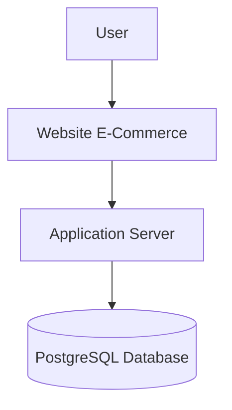
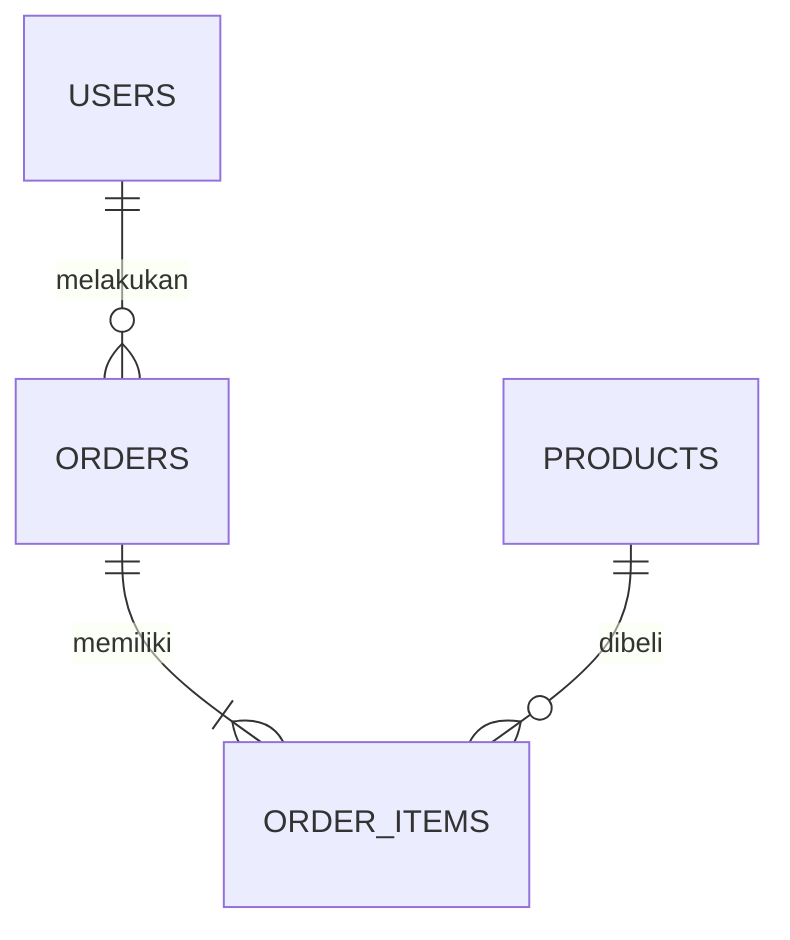

# Arsitektur Sistem dan Skema Database

## 1. Arsitektur Sistem

Penelitian ini menggunakan arsitektur tiga lapis (Three Tier Architecture) yang terdiri atas Presentation Layer, Application Layer, dan Database Layer.



Pada arsitektur tersebut seluruh transaksi pelanggan diproses oleh application server sebelum diteruskan ke PostgreSQL.

---

# 2. Skema Database

Database yang digunakan terdiri dari beberapa tabel utama.

## users

| Field | Type |
|--------|------|
| id | SERIAL |
| nama | VARCHAR |
| email | VARCHAR |
| password | VARCHAR |

---

## products

| Field | Type |
|--------|------|
| id | SERIAL |
| nama_produk | VARCHAR |
| kategori | VARCHAR |
| harga | NUMERIC |
| stok | INTEGER |

---

## orders

| Field | Type |
|--------|------|
| id | SERIAL |
| id_user | INTEGER |
| tanggal | DATE |
| total | NUMERIC |

---

## order_items

| Field | Type |
|--------|------|
| id | SERIAL |
| order_id | INTEGER |
| product_id | INTEGER |
| qty | INTEGER |
| subtotal | NUMERIC |

---

# 3. Entity Relationship Diagram



---

# 4. Operasi CRUD

Operasi yang diuji meliputi:

- Create
- Read
- Update
- Delete

Seluruh operasi dilakukan pada tabel products sebagai objek utama benchmark.

---

# 5. Strategi Indexing

Penelitian membandingkan tiga strategi indexing.

## No Index

Tidak menggunakan secondary index.

## Single Index

```sql
CREATE INDEX idx_category
ON products(category);
```

## Composite Index

```sql
CREATE INDEX idx_category_price
ON products(category,harga);
```

---

# 6. Alur Pengujian

```mermaid
flowchart LR

Dataset

-->

PostgreSQL

-->

CRUD Benchmark

-->

Collect Result

-->

Statistical Analysis
```

---

# 7. Variabel Penelitian

## Variabel Bebas

- Strategi Indexing
- Ukuran Dataset

## Variabel Terikat

- Response Time
- Throughput
- CPU Usage
- Memory Usage

## Variabel Kontrol

- Hardware
- PostgreSQL Version
- Sistem Operasi
- Query SQL